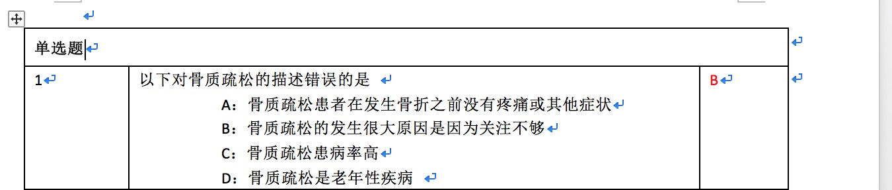

# parseWordDocument

Parse the microsoft word document form tool in the egg framework

## file limit

1. 使用表格布局
2. 每个表格第一行， 文字应为 ‘单选题’ 或者 ‘多选题’
3. 每个表格除了第一行，要有题目序号，题目问题以及题目答案
4. 题目+答案不应少于5行

格式如下图示例



## QuickStart

<!-- add docs here for user -->

see [egg docs][egg] for more detail.

### Development

```bash
$ npm i
$ npm run dev
$ open http://localhost:7001/
```

### Deploy

```bash
$ npm start
$ npm stop
```

### npm scripts

- Use `npm run lint` to check code style.
- Use `npm test` to run unit test.
- Use `npm run autod` to auto detect dependencies upgrade, see [autod](https://www.npmjs.com/package/autod) for more detail.


[egg]: https://eggjs.org